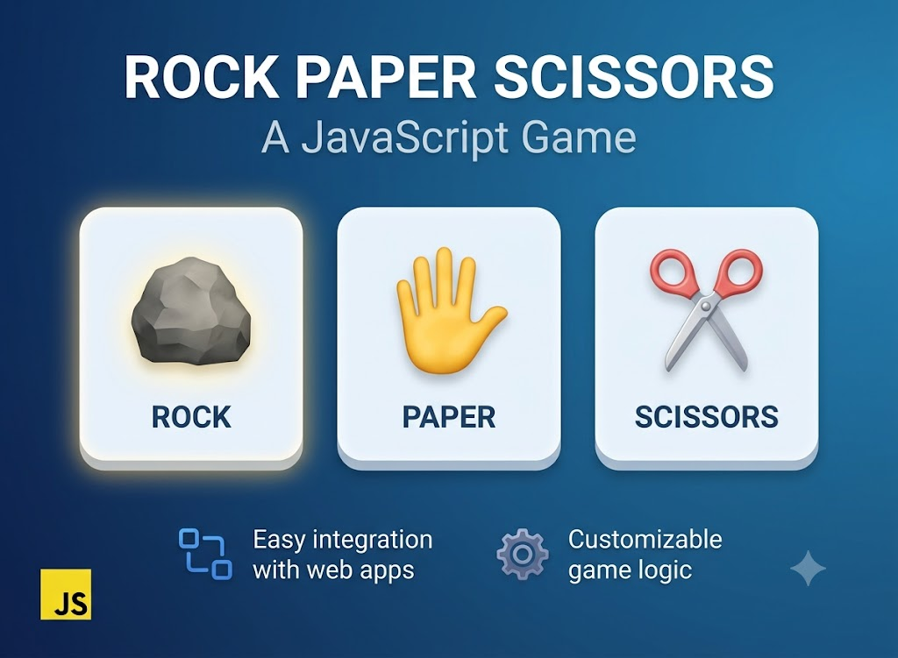

# Rock Paper Scissors — Lesson Project

Цей проєкт зроблено на уроках з ментором як навчальна вправа для демонстрації DOM, подій та передачі параметрів між сторінками.

## Що робить проєкт

- пропонує вибрати один із варіантів: камінь, папір або ножиці;
- генерує випадковий вибір комп’ютера;
- передає обрані значення через URL-параметри на сторінку результату;
- визначає переможця, показує підсумок та дозволяє розпочати гру заново.

## Використані технології

- HTML для структури ігрових кнопок та сторінки результату;
- CSS для оформлення кнопок, макета та сторінки результату;
- JavaScript для обробки кліків, генерації комп’ютерного вибору та логіки визначення переможця;
- URL API (`URLSearchParams`) для передачі даних між сторінками.

## Навички, які відпрацьовано

- робота з DOM: `querySelectorAll`, `addEventListener`, `querySelector`, `classList`, `style`, `innerHTML`;
- обробка подій кліку та визначення вибору користувача;
- використання `Math.random()` для випадкового вибору комп’ютера;
- передача стану між сторінками через URL-параметри (`location.href`, `URLSearchParams`);
- управління результатом: порівняння вибору користувача та комп’ютера, відображення переможця;
- обробка ситуації некоректного запуску сторінки результату без параметрів.

## Структура проєкту

- `index.html` — стартова сторінка із вибором гри;
- `styles.css` — стилі для інтерфейсу;
- `script.js` — логіка вибору та перенаправлення на результат;
- `winner.html` — сторінка результату гри;
- `winner.js` — логіка відображення результату та визначення переможця.

## Контекст створення

Цей проєкт реалізовано на уроках з ментором як завершена навчальна вправа. Він служить демонстрацією практичного застосунку фронтенд-навиків і не передбачає подальших оновлень.